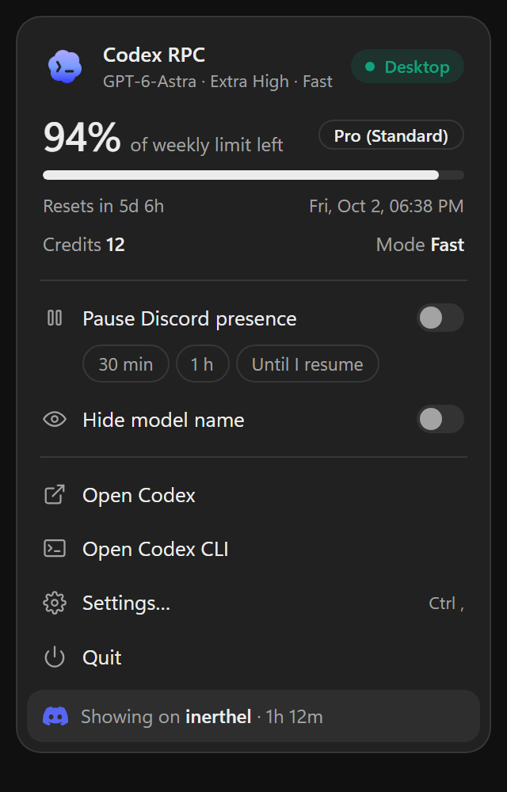
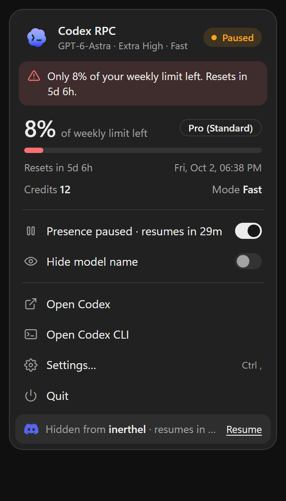
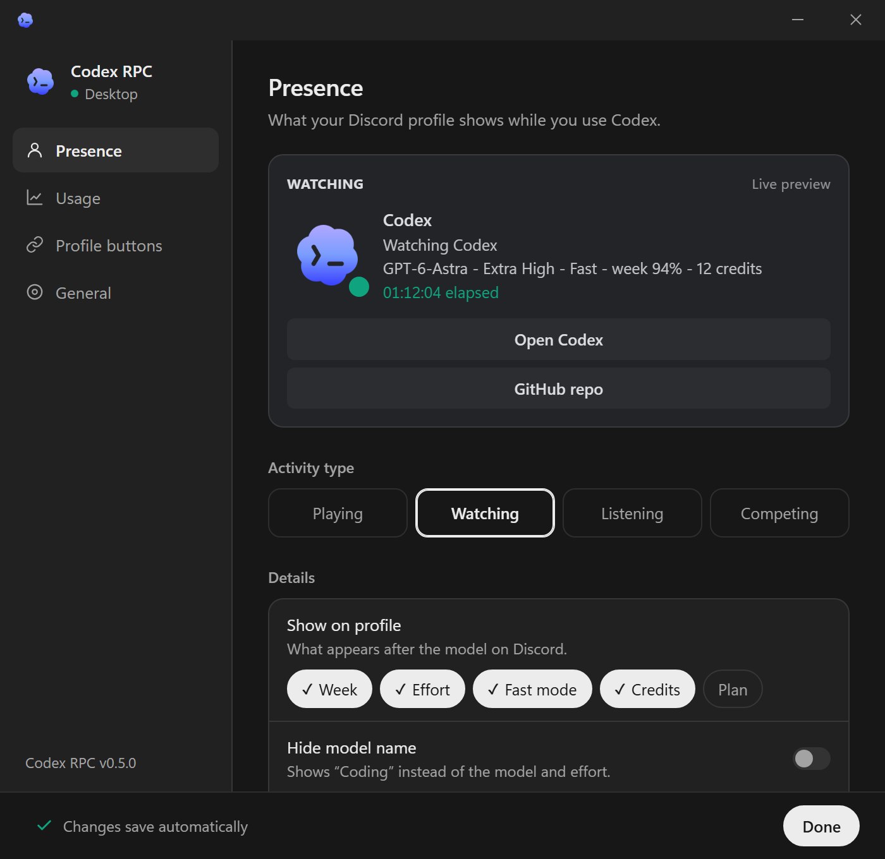
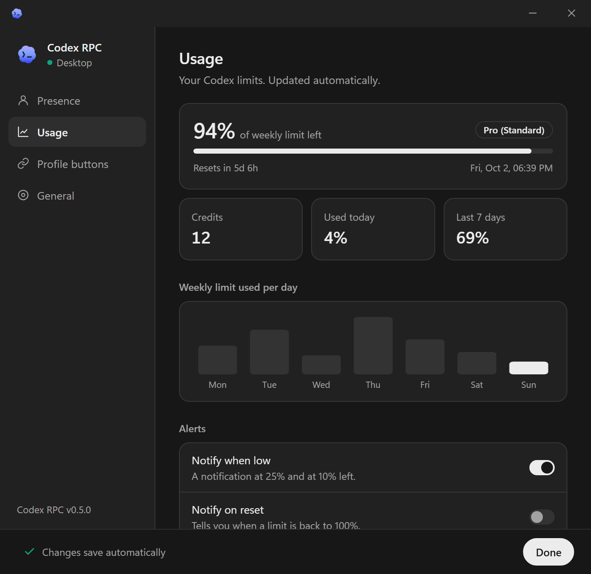
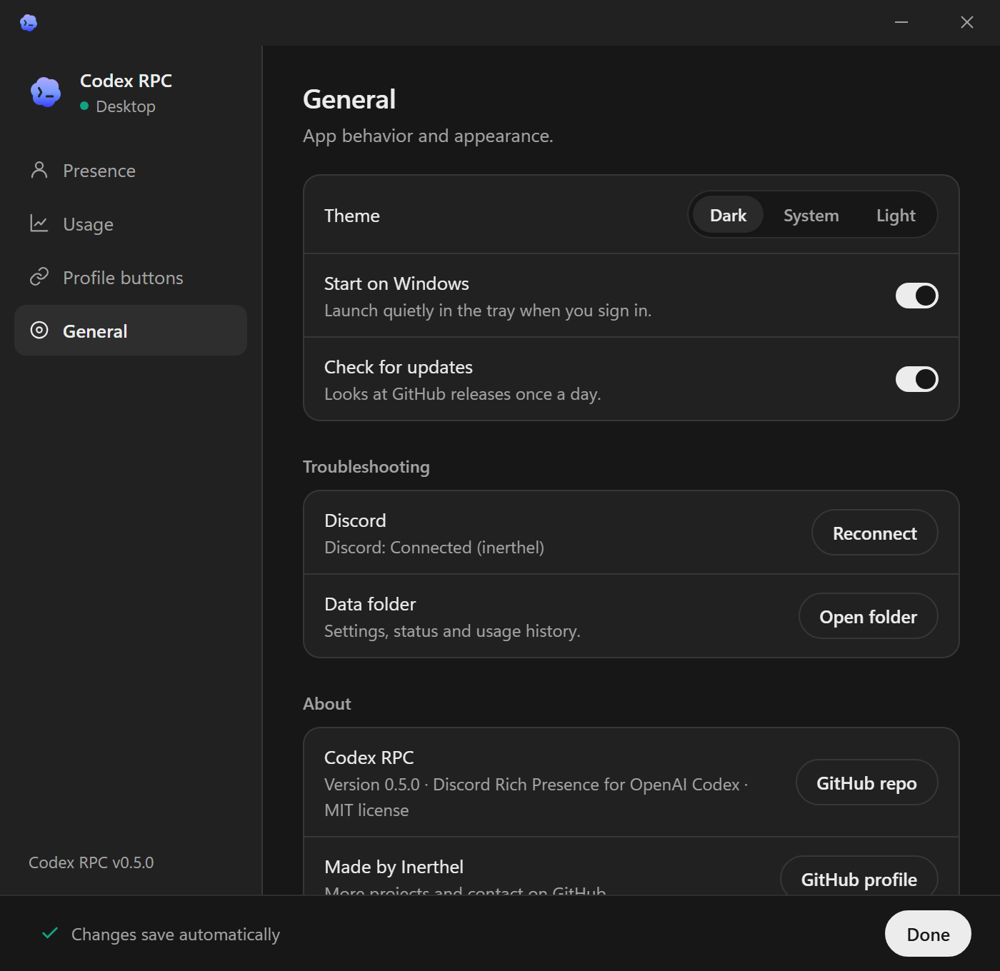

# Codex RPC

Codex RPC shows local Codex activity and account usage in a Windows or macOS tray app and sends the activity to Discord Rich Presence. It supports Codex CLI and Codex Desktop.

## Requirements

- Windows or macOS with a running Discord desktop client.
- Windows: WebView2 Runtime. Source builds also need Node.js 22, Rust/Cargo, Visual Studio 2022 Build Tools with MSVC v143, and the Windows SDK.
- macOS source builds: Node.js 22, Rust/Cargo, and Xcode Command Line Tools.
- TODO: Document the minimum supported Windows, macOS, and Rust versions.

## Install

Download the installer for your platform from [GitHub Releases](https://github.com/inerthel-agi/codex-rpc/releases/latest), then run it. The Windows release also provides a portable executable.

To build from source on Windows:

```powershell
npm ci
npm run tauri:build:windows
```

To build from source on macOS:

```bash
npm ci
npm run tauri:build:macos
```

The Windows build places the portable executable at `bin/codex-rich-presence.exe`. The macOS build creates an app bundle and DMG under `src-tauri/target/release/bundle/`.

Run the unit tests with:

```powershell
npm test
```

## Usage

Start Codex RPC from the installer or launch the portable Windows build:

```powershell
.\bin\codex-rich-presence.exe
```

The app starts in the system tray. Left-click its icon to open settings. Right-click it to open the tray menu. The screenshots below use sample data.

### Tray menu

 

- The header shows the Codex source (Desktop, CLI, or both) and the current model.
- The usage block shows the remaining limit, the plan, and when the limit resets. A warning appears at 25% and at 10% left.
- **Pause Discord presence** hides the activity for 30 minutes, 1 hour, or until you resume it.
- **Hide model name** replaces the model and effort with `Coding` on Discord.
- **Open Codex** starts Codex Desktop. **Open Codex CLI** opens Command Prompt in your home folder, or Terminal on macOS, and runs `codex`.
- The tray icon turns grey when Codex is off and shows a dot when the presence is paused or a limit is low.

### Settings



**Presence** previews the Discord card as it will appear. It sets the activity type, the details shown after the model (5-hour and weekly limits, effort, Fast mode, credits, plan), the elapsed timer, clearing the presence after 15, 30, or 60 idle minutes, and an optional custom status line. The custom line accepts `{model}`, `{effort}`, `{speed}`, `{5h}`, `{week}`, `{credits}`, `{plan}`, and `{project}`.



**Usage** shows each limit with its reset time, the remaining credits, usage today and over the last 7 days, and a daily chart. The history is stored locally. It also turns on system notifications when a limit drops to 25% and 10%, or when it resets.



**Profile buttons** holds up to two links. Discord shows them only in Watching mode, and other people see them only if you have Discord Nitro. **General** sets the theme, start at login, and the daily update check. It also reconnects Discord and opens the data folder.

Codex RPC shows the weekly allowance for Pro subscriptions and both 5-hour and weekly allowances for Plus when Codex reports those limits. The plan badge reads `API key / unknown` when Codex reports no subscription.

## Configuration

The settings window saves every option above except the theme, which stays in the window's local storage. Settings are stored in `%LOCALAPPDATA%\codex-rich-presence\rpc-buttons.json` on Windows and `~/Library/Application Support/codex-rich-presence/rpc-buttons.json` on macOS.

| Variable | Type | Default | Effect |
| --- | --- | --- | --- |
| `DISCORD_CLIENT_ID` | string | Bundled Discord application ID | Overrides the Discord application ID. |
| `SCAN_INTERVAL_MS` | integer, milliseconds | `5000` | Process scan interval; minimum `2000`. |
| `IDLE_GRACE_MS` | integer, milliseconds | `10000` | Delay before clearing activity after Codex exits. |

## Limitations

- Discord must be running for Rich Presence to appear.
- The macOS app is ad-hoc signed and is not notarized. If Gatekeeper blocks the download, clear its quarantine attribute with `xattr -cr "/Applications/Codex RPC.app"` after reviewing the app.
- Usage windows other than 5 hours and one week are not displayed.

## License

MIT. See [LICENSE](LICENSE).
